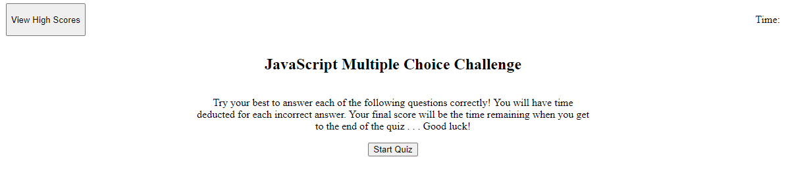
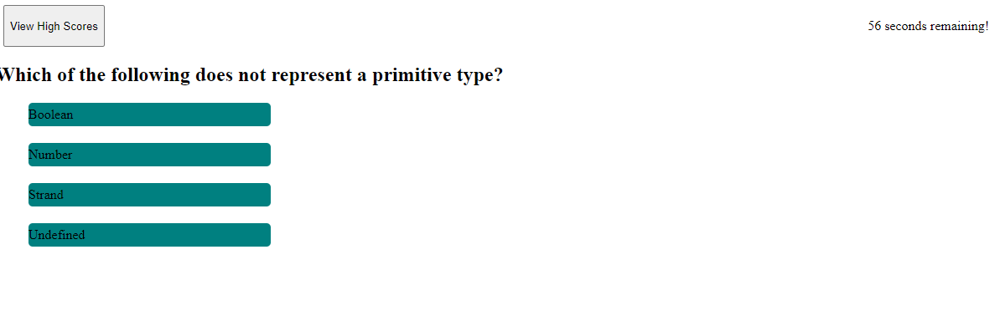
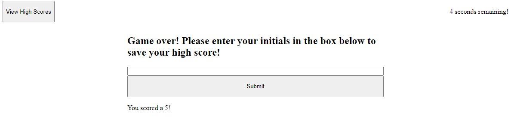
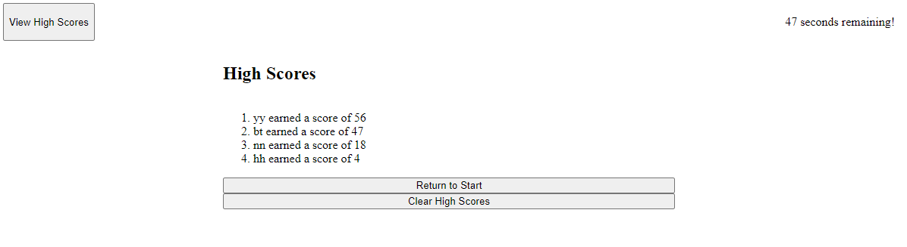

# javascript-quiz

## Description
With an ability to write basic applications using JavaScript, taking full advantage of the Web API was a natural next step. This quiz utilizes JavaScript and the Web API to test users' understandings of the rudimentary basics of JavaScript. Users can save their high scores so that they are able to track their progress against their peers as they progress through their learning. Users no longer must idly wonder if their skills match up, now they may put them to the test. 

Application is live and may be visited [here.] (https://csanchezwagenbach.github.io/javascript-quiz/)

## Installation
No special steps required for installation. The application may be accessed on any browser by following the url.

## Usage
 The above screen loads upon the user navigating to the url. At any point throughout the application the user may click the "View High Scores" button and be taken to the high score display (shown below). When the user clicks "Start Quiz," the timer will begin counting down from 60 and the user will see the first question with associated answer choices.
 After clicking "Start Quiz" the user will see the question displayed along with four answer choices styled to resemble buttons. When the user clicks on an answer choice, the next question and a new set of answers appears on the screen. If the user answers incorrectly, ten seconds are decremented, otherwise, the quiz continues.

When the timer reaches 0 or the user runs out of questions, the user is brought to the end game display. Here the users will see their final score reported back to them and be given the opportunity to contribute their initials and high score to the running list. 

Finally, the user is shown the display of all recorded and saved high scores. If the user clicks the "return" button, they will be sent back to the start display so they may begin the quiz again. Otherwise, the user may clear the high scores menu, upon which the page reloads and they are sent back to the start display. 

## License 
MIT License

Copyright (c) 2022 Colby Sanchez Wagenbach

Permission is hereby granted, free of charge, to any person obtaining a copy
of this software and associated documentation files (the "Software"), to deal
in the Software without restriction, including without limitation the rights
to use, copy, modify, merge, publish, distribute, sublicense, and/or sell
copies of the Software, and to permit persons to whom the Software is
furnished to do so, subject to the following conditions:

The above copyright notice and this permission notice shall be included in all
copies or substantial portions of the Software.

THE SOFTWARE IS PROVIDED "AS IS", WITHOUT WARRANTY OF ANY KIND, EXPRESS OR
IMPLIED, INCLUDING BUT NOT LIMITED TO THE WARRANTIES OF MERCHANTABILITY,
FITNESS FOR A PARTICULAR PURPOSE AND NONINFRINGEMENT. IN NO EVENT SHALL THE
AUTHORS OR COPYRIGHT HOLDERS BE LIABLE FOR ANY CLAIM, DAMAGES OR OTHER
LIABILITY, WHETHER IN AN ACTION OF CONTRACT, TORT OR OTHERWISE, ARISING FROM,
OUT OF OR IN CONNECTION WITH THE SOFTWARE OR THE USE OR OTHER DEALINGS IN THE
SOFTWARE.

